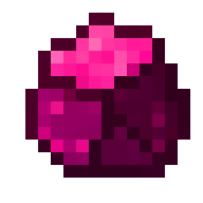

<h1 align="center">
  
 kitamin</h1>

<em>Roblox administration, controlled.</em>

 
An extensible command bar for Roblox experiences with fine-grained customization for the perfect solution to any need.

<h2>References</h2>
This project wouldn't be possible without the amazing work of the following projects:
<ul>
<li><a href="https://github.com/evaera/Cmdr">github.com/evaera/Cmdr</a></li>
<li><a href="https://github.com/paradoxuum/centurion">github.com/paradoxuum/centurion</a></li>
</ul>

<h2>Source Conditions</h2>
This project is licensed under the <a href="./LICENSE">European Union Public License (EUPL), version 1.2</a> or later. The project's logo (specifically this <a href="./assets/logo.png">file</a>) is licensed under the MIT license as it is a modification of the cyclic:gem_obsidian icon.
